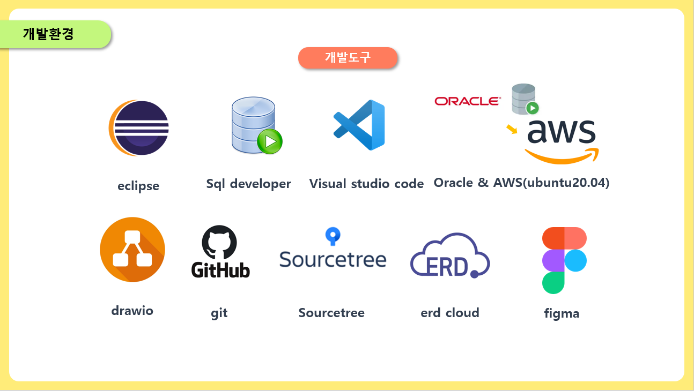

# <b>🏢빌딩숲🌳</b> 
 

    
    
<b>💌 가까운 이웃을 연결하는 새로운 소셜 네트워크 💌</b>

 

# <b>📖프로젝트 소개 </b>
> "빌딩숲"은 같은 빌딩을 이용하는 직장인들을 위한 다목적 커뮤니티입니다. 
> 
> 이용자들은 정보 공유, 소통, 협력을 통해 더 나은 삶과 편의성을 즐길 수 있습니다. 함께하는 "빌딩숲"에서 이용자들은 친목을 도모하며, 리소스를 공유하고 생활의 질을 향상시킬 수 있습니다.

# <b>💻 메인화면 </b>

 

# <b>💖개발배경</b> 

 

# <b>⚙︎개발환경</b> 

# <b>📂ERD</b>

# <b> 👩🏻‍🏫기능설명

# <b>🔗시연영상</b>
[빌딩숲 시연영상](https://youtu.be/x7EM-7cjLDk)

# <b>🙋‍♀️역할분담</b>
